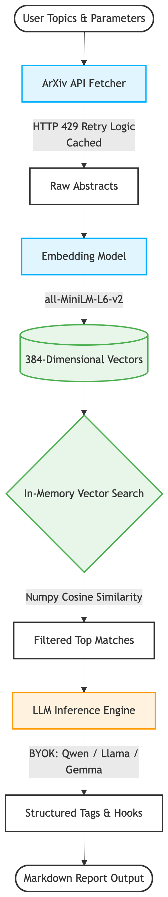

<p align="center">
  <a href="https://github.com/devimisra/arxiv-radar/actions"></a>
  <a href="https://www.python.org/downloads/"></a>
  <a href="https://opensource.org/licenses/MIT"></a>
</p>

**Taming the ArXiv Firehose: Building a Serverless RAG Pipeline for Paper Discovery**

[Live Demo](https://arxiv-radar.streamlit.app)

**ArXiv Radar** is a domain-agnostic data pipeline designed to filter the daily noise of scientific publications. Moving beyond traditional keyword matching, this tool uses 384-dimensional vector embeddings to score ArXiv papers based on semantic relevance, and open-weights Large Language Models (LLMs) to generate strict, one-sentence technical insights for top-ranking papers.



## How to Use ArXiv Radar
1. **Provide a Token (BYOK):** Navigate to your Hugging Face account settings, generate a "Read" access token, and securely enter it in the app's sidebar. The application is stateless; your token is only used for the active session and is never stored.
2. **Set Your Target Category:** Enter an ArXiv category code (e.g., `cs.LG` for Machine Learning, `astro-ph.CO` for Cosmology).
3. **Define Research Interests:** Input highly specific technical phrases or methodologies. The system uses semantic search, so descriptive context works better than single-word keywords.
4. **Select an AI Model:** Choose an open-weights model (e.g., Llama 3.1, Gemma 2, or Qwen) to generate the technical hooks.
5. **Scan and Export:** Execute the scan to filter the latest papers. Review the results in the UI and download your curated daily reading list as a clean Markdown (`.md`) file.

## Formulating Your Research Topics
Because this tool uses semantic vector embeddings rather than simple CTRL+F keyword matching, **context matters**. To get the best results, you should be highly specific in your research topics.

* **Bad Example:** `Machine Learning, AI, Biology` 
  *(Too broad. The model will return generic papers with low relevance scores).*
* **Good Example:** `parameter-efficient fine-tuning for large language models, LoRA, QLoRA, quantization techniques` 
  *(Highly specific. The embedding model will capture the mathematical meaning of these concepts and find papers discussing them, even if those exact words are not in the abstract).*

## Architecture & Evaluation
This project was designed to demonstrate clean separation of concerns, cost-efficient deployment, and rigorous prompt engineering.

* **Serverless BYOK:** Implements a stateless architecture with zero database overhead. Users securely input their own tokens to dynamically route inference, making the app infinitely scalable.
* **Infrastructure Resilience:** Implements aggressive exponential backoff, retry logic, and memory caching (`@st.cache_data`) to prevent `HTTP 429 (Too Many Requests)` firewall blocks from the ArXiv API in shared-IP cloud environments.
* **Separation of Concerns:** Business logic (vector math, API routing) is completely decoupled from the UI layer (`main.py`), allowing for isolated automated testing.
* **Automated CI/CD Testing (`test_pipeline.py`):** A custom, parameterized `pytest` suite runs automatically via GitHub Actions on every code push. This pipeline guarantees system reliability by evaluating:
  * **Embedding Recall:** Ensures cosine similarity thresholds correctly isolate highly relevant papers using a baseline "golden dataset" of positive and negative queries.
  * **LLM Constraint Adherence:** Verifies the core prompt architecture (benchmarked continuously against our default model, Qwen 2.5) strictly adheres to structural formatting (`TAGS:` and `HOOK:`) and one-sentence maximums without hallucinating conversational filler.

## Technology Stack
* **Frontend/Hosting:** Streamlit Community Cloud
* **Embeddings:** `sentence-transformers` (`all-MiniLM-L6-v2`), `numpy`
* **Generative AI:** Hugging Face Inference API (Llama 3.1, Gemma 2, Qwen)
* **Data Ingestion:** ArXiv Python API
* **CI/CD:** GitHub Actions, Pytest

## Running Locally

1. Clone the repository and navigate to the project directory:
```bash
   git clone https://github.com/YOUR_USERNAME/arxiv-radar.git
   cd arxiv-radar
```
2. Install the required dependencies:
```bash
   pip install -r requirements.txt
```
3. Set up your local secrets by creating a `.streamlit/secrets.toml` file and adding your Hugging Face API key:
```toml
   HF_TOKEN = "your_hf_token_here"
```
4. Run the Streamlit application:
```bash
   streamlit run main.py
```
5. Run the evaluation suite (`test_pipeline.py`):
```bash
   export HF_TOKEN="your_hf_token_here"
   pytest test_pipeline.py -v
```